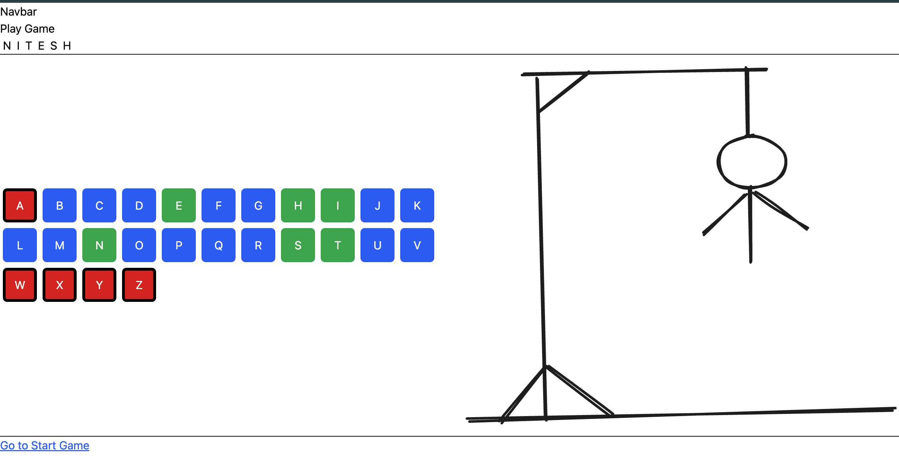

🎯 Hangman Game (React)

A simple Hangman-style game UI built using React, focusing on state management, component-based structure, and interactive letter selection.

This project currently demonstrates the core mechanics and UI of Hangman

  

---

🚀 Features

⌨️ On-screen alphabet keyboard (A–Z)

🎨 Color-coded letters:

🟢 Correct guesses

🔴 Incorrect guesses

🔵 Unused letters

🔤 Real-time update of selected letters

🧍 Visual Hangman drawing display

🧩 Masked word display (reveals letters as guessed)

---

## 🛠 Tech Stack
- React
- JavaScript (ES6+)
- HTML
- CSS / Tailwind CSS
- Vite

🧠 What This Project Focuses On

Managing array state in React

Understanding immutability (setState with new arrays)

Passing state and handlers via props

Conditional styling based on state

Breaking UI into reusable components

